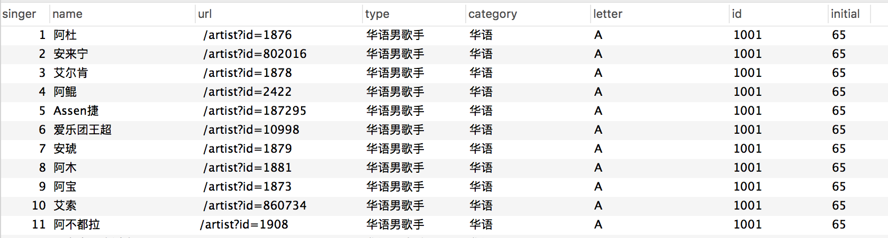
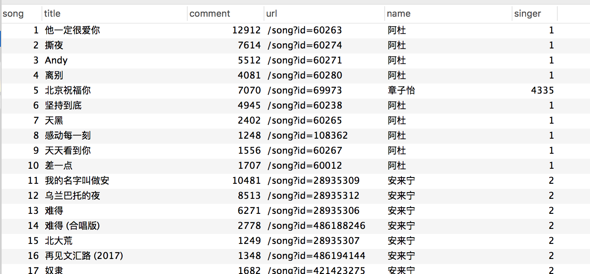

持续更新，过两天会加上项目的数据统计以及展示页面。

## 使用

把仓库`clone`到本地后`cd`到`spider`目录下，`npm install`安装依赖。具体的使用请参照下面的内容，需要进行一些配置。

## 新增特性

#### 新增爬取过程中出错时智能提醒

爬虫爬取过程中如果出错，如服务端503或者当前页面不存在时，会自动弹出一个CMD提醒用户。

#### 去除Nightmare层

根据issue的建议，去除了Nightmare层，因为可以直接拿到数据的相关接口，不再需要解析iframe模块。

#### 新增智能断点

爬取歌曲的过程中，如果中途退出爬虫，下次启动会自动从上次中断的位置重新开始。

## 图片展示


歌手信息
<br/>


歌曲信息
<br/>



## 项目结构

```
.
├── README.md
├── img
│   ├── example.png
│   └── singer.png
├── spider
│   ├── code
│   │   ├── index.js
│   │   ├── singer.js // 爬虫逻辑
│   │   └── song.js  // 爬虫逻辑
│   ├── config
│   │   ├── index.js
│   │   ├── mysql.js
│   │   ├── singer.js
│   │   ├── song.js
│   │   └── 数据表结构.txt
│   ├── mysql
│   │   └── index.js
│   ├── singer.js
│   ├── song.js
│   ├── package.json
│   ├── test
│   │   ├── test-nightmare-async.js
│   │   ├── test-notify.js
│   │   ├── test-proxy-mysql.js
│   │   └── test.js
│   └── util
│       └── index.js
└── 项目日志.md
```

## 配置

#### 建立数据表

需要建立`singer`表以及`song`表，分别用于存放歌手信息以及歌曲信息。对应的表结构存放于`confg`目录下。在创表过程中对应的字段均可修改，但是修改后需要在爬虫代码中修改为对应字段。

#### 修改数据库配置

数据库的账号密码在`config`目录下的`mysql`中，修改为你自己的账号密码。

#### 配置encSecKey

在`config`目录下有一个`song.js`文件，其中对应的encSecKey以及params字段需要修改为你自己的。

请求`https://music.163.com/weapi/v1/resource/comments/R_SO_4_185809?csrf_token=`，在`network`面板中可找到这两个字段。

可以尝试获取多组encSecKey，然后在请求的过程中不断的更换encSecKey字段应该可以起到一定的防屏蔽作用。

## 启动

配置完成以及安装好依赖后，就可以启动项目了，通过`node singer.js`即可开始歌手信息的抓取，这个过程会比较快，一般不会存在什么问题。

等待歌手信息抓取完毕后，通过`node song.js`就可以开始所有歌曲的抓取。

建议使用`devtool`运行，调试较为方便。

30万首歌曲抓取时间过长，有可能会遇到服务端的屏蔽，如503报错，此时需要停下来等待一段时间。至于其他错误在程序中都有一些简单的处理。

当程序中断后，重新爬取前可以修改`core\song.js`中的`index`为数据库中最后一个歌手的索引，这样程序就可以从上次停下的位置继续抓取数据。

## 注意

本爬虫不部署到服务器上，在本地执行。所以如果需要部署到服务器上还需要自己加上更丰富的错误处理，以及防屏蔽操作。

## 关于防屏蔽

#### 更换IP

本来是打算写更换IP的，但是在测试的过程中发现一开代理数据库就提示

`Error: Connection lost: The server closed the connection.(…)`

找了一圈解决办法并没有发现合适的，然后网易云屏蔽IP也不太严重，所以干脆不做这个功能了。

#### 配置多组USER-AGENT以及encSecKey，随机更改

这种方法应该是可行的，但是能坚持多久就不知道了。

#### 伪装成为百度爬虫

伪装成百度爬虫不知是否可行。

## 性能

写出来的第一个版本平均1.5秒一首歌曲，要抓5天左右。

之后更新了第二个版本，每首歌曲耗时0.2秒，性能大大提升，抓30万首歌曲估计耗时16个小时。

## 实现

爬取歌手页面的所有歌手，根据歌手索引当前歌手热度前10的歌进行评论分析。

~~网易云音乐的内容都是由JS动态的插入iframe中的，所以需要一个能够执行JS的库~~

~~采取Nightmare来实现iframe部分的处理~~

## 错误日志

```
Uncaught (in promise) 
Object {
    message: "navigation error", 
    code: -7, 
    details: "Navigation timed out after 30000 ms", 
    url: "https://music.163.com/#/artist?id=7672"
    }
```
nightmare层报错，由于网络问题导致该次请求不成功，没有处理timeout抛出的错误。已经处理

```
Cannot read property 'innerHTML' of null ESNO 请求超时 即将重新请求
```
有可能是当前歌手对应的页面404，已经丢失或者更新。已经处理

## Contribute

欢迎提交代码，有问题可以建`issue`。

本来是打算使用`async/await`重构一次代码的，但是因为使用了`async`这个库，库的	`AsyncFunction`参数对`async/await`的支持不太友好，之后会换库然后进行一次关于回调函数方面的重构。
