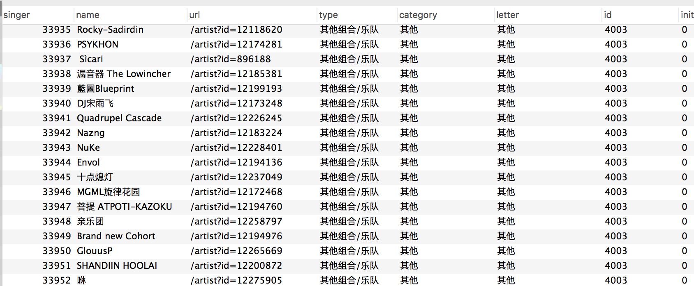

### 项目日志

仅作为记录使用

#### 更新

nightmare配合nightmare-iframe-manager处理了iframe页面的内容，成功抓取了网易云上歌手页面的所有歌手以及对应的歌单链接，存储在数据库中。刚刚把所有的歌手都抓取下来了，一共是33952名歌手。不太确定这是否就是所有的歌手，但是应该都是知名度Top的了，所以对于本次针对歌曲评论排行的需求而言足够了。

另外初次抓取并没有采用并发等等特性，仅仅是一次测试结果全部数据抓取回来了。所以程序性能还有待修改。

抓取歌手的脚本在`singer.js`中，另外具体的配置参照`config`。

#### 更新

目前性能瓶颈在于抓取的数据都在iframe中加载的，需要配合nightmare进行iframe框架的解析，nightmare无法同时解析多个页面，所以只能等待当前页面数据抓取完毕才能发起下次请求。因此不能并发多个请求。

或许可以使用`cluster`模块优化此问题从而达到并发。

#### 更新

目前抓取歌曲评论的脚本写好了，正在抓取中。并发的问题暂时还没有处理。30000万歌手，每个歌手抓取10首歌曲进行分析，~~按平均每首歌15秒的时间计算，预计耗时52天~~ 刚刚算错了，吓死我了。应该是平均每个歌手15秒，每首歌大概1.5秒的时间，所以耗时5天。但是时间还是很长，所以继续优化。

#### 优化记录

版本1 平均每首歌 1.5秒 需要 **5天**

版本2 平均每首歌 0.1-0.4秒 30万首歌的评论需要 **16个小时**